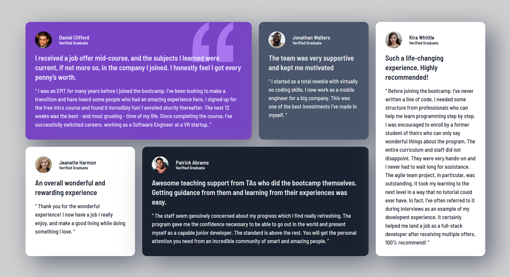

# 📌 Testimonials Grid Section

## 📌 Overview
The **Testimonials Grid Section** challenge was a layout-based challenge designed for anyone looking to test their **CSS Grid skills**. This project focuses on creating a **multi-column, responsive layout** while positioning elements effectively using CSS Grid.

## 🎯 Objectives
- Build a **fully responsive** testimonials section.
- Utilize **CSS Grid** to create a structured and visually appealing design.
- Implement **box shadows** and **background images** for better aesthetics.
- Ensure compatibility across different screen sizes using **media queries**.

## 🛠️ Technologies Used
- **HTML5**
- **CSS3** (including Grid, Flexbox, Variables, and Reset Styles)

## 📸 Screenshot


## 🚀 Live Demo
Check out the live project here: **[Testimonials Grid Section](https://jayco01.github.io/testimonials-grid-section/)**

## 📂 Repository
GitHub Repo: **[testimonials-grid-section](https://github.com/jayco01/testimonials-grid-section.git)**

## 🏆 Challenges Faced
One of the main challenges was ensuring **proper spacing and alignment** using **CSS Grid**. Initially, positioning elements and defining grid areas caused inconsistencies. However, after refining `grid-template-areas` and `grid-template-columns`, the layout became more structured and adaptable.

## 🎓 Lessons Learned
Through this project, I learned:
- How to **effectively use CSS Grid** for a structured layout.
- How to implement **background images** and control their positioning.
- Improved my understanding of **box-shadow** for better visual depth.
- How to use **media queries** efficiently for different screen sizes.
- The importance of **semantic HTML** for readability and accessibility.

## 🔥 Future Improvements
- Enhance **accessibility features** (e.g., ARIA labels, improved contrast).
- Add **subtle hover effects** to improve user interaction.
- Optimize CSS for better **performance and maintainability**.

## 📚 Resources & Credits
This project was built as part of the **Frontend Mentor Challenge**. Additional resources that helped me along the way include:
- [CSS Grid Guide](https://css-tricks.com/snippets/css/complete-guide-grid/) by **CSS-Tricks**
- [Kevin Powell’s YouTube Channel](https://www.youtube.com/kepowob) for CSS insights

## 🏗️ How to Run the Project Locally
1. Clone the repository:
   ```sh
   git clone https://github.com/jayco01/testimonials-grid-section.git
   ```
2. Open the project folder:
   ```sh
   cd testimonials-grid-section
   ```
3. Open `index.html` in a browser.

---

🚀 **Thank you for checking out my project!** Feel free to fork the repo or provide feedback to help me improve. 😊